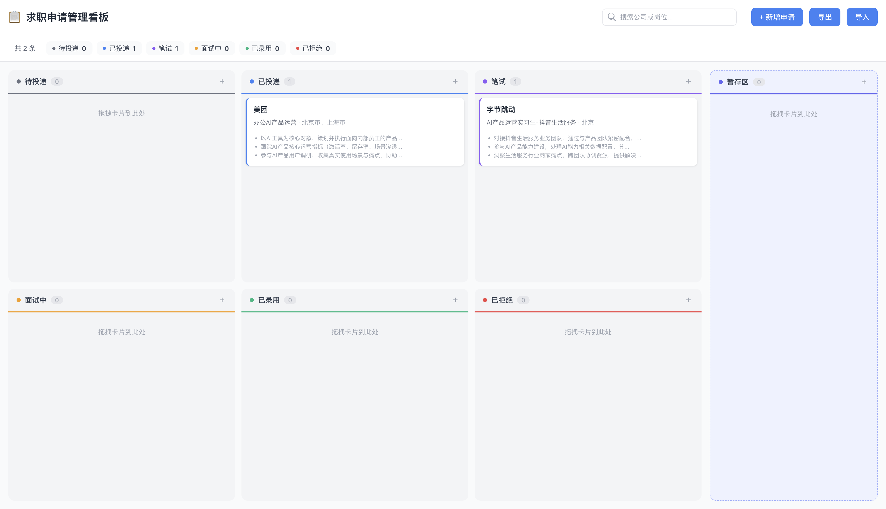

<div align="center">

# Job Tracker

**专为大学生求职季打造的看板式申请管理工具**

[](https://react.dev)
[](https://www.typescriptlang.org)
[](https://vite.dev)
[](./LICENSE)

</div>

---

## 预览



---

## 功能特性

| 分类 | 说明 |
|------|------|
| **看板管理** | 6 阶段流水线（待投递 → 已投递 → 笔试 → 面试中 → 已录用 / 已拒绝）+ 暂存区 |
| **拖拽交互** | 卡片拖拽即改状态，基于 `@dnd-kit` 实现 |
| **智能识别** | 粘贴招聘信息文本，自动提取岗位名、工作地点、职责描述、任职要求 |
| **公司联想** | 预置 30+ 互联网公司，输入即模糊搜索 |
| **截止提醒** | 3 天内黄色预警，过期红色标记 |
| **全文搜索** | 支持公司、岗位、地点、备注多字段检索 |
| **数据导出/导入** | JSON 一键备份恢复，不怕清缓存丢数据 |
| **纯本地运行** | 无需后端，数据存浏览器 LocalStorage，debounce 写入优化性能 |

---

## 技术栈

| 层级 | 技术 |
|------|------|
| 框架 | React 19 + TypeScript 6 |
| 构建 | Vite 8 |
| 拖拽 | @dnd-kit/core + @dnd-kit/sortable |
| 样式 | CSS Modules |
| 持久化 | LocalStorage（防抖写入） |

---

## 快速开始

### 环境要求

- Node.js >= 18
- npm >= 9

### 安装运行

```bash
git clone https://github.com/hxhfuudd-ship-it/job-tracker.git
cd job-tracker
npm install
npm run dev
```

浏览器打开 http://localhost:5173 即可使用。

### 生产构建

```bash
npm run build
npm run preview
```

---

## 项目结构

```
src/
├── App.tsx                     # 根组件，全局状态管理
├── types.ts                    # TypeScript 类型定义
├── constants.ts                # 列配置、公司预设
├── hooks/
│   └── useLocalStorage.ts      # 防抖 localStorage Hook
└── components/
    ├── Board/                  # DnD 上下文、列布局
    ├── Column/                 # 可放置列
    ├── Card/                   # 可排序申请卡片
    ├── Modal/                  # 新增/编辑表单 + 智能识别
    ├── Stats/                  # 流水线统计
    └── SearchBar/              # 搜索输入
```

---

## 规划中

- [ ] 暗色模式
- [ ] 日历视图展示截止日期
- [ ] 浏览器插件一键抓取招聘信息
- [ ] 云端同步（可选后端）
- [ ] 简历匹配度评分

---

## 参与贡献

欢迎贡献！请先开 Issue 讨论你想做的改动。

1. Fork 本仓库
2. 创建分支 (`git checkout -b feat/amazing-feature`)
3. 提交改动
4. 推送分支
5. 发起 Pull Request

---

## 许可证

[MIT](./LICENSE)

---

<div align="center">
<sub>基于 React + TypeScript 构建，为中国求职市场设计。</sub>
</div>
